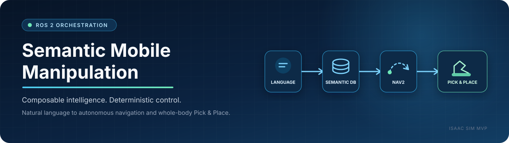
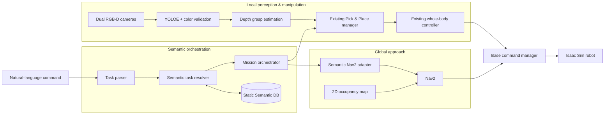

<p align="center">
  
</p>

<p align="center">
  
  
  
  
  
</p>

<p align="center">
  <strong>A modular mobile-manipulation stack that connects natural-language intent to semantic lookup, autonomous navigation, and precise whole-body Pick &amp; Place.</strong>
</p>

<p align="center">
  <a href="#overview">Overview</a> ·
  <a href="#architecture">Architecture</a> ·
  <a href="#capability-status">Status</a> ·
  <a href="#quick-start">Quick Start</a> ·
  <a href="#packages">Packages</a> ·
  <a href="#documentation">Documentation</a>
</p>

---

## Overview

This repository implements a composable ROS 2 orchestration layer for semantic
mobile manipulation in Isaac Sim. A natural-language command is resolved
against a static object database, converted into a Nav2 approach goal, and then
handed to the previously validated RGB-D and whole-body manipulation pipeline.

The central engineering constraint is simple: **extend the system without
replacing the motion behavior that already works**.

| Concern | System approach |
|---|---|
| Task input | Korean or English natural-language Pick & Place command |
| Semantic memory | SQLite object records with `map`-frame positions and prevalidated approach poses |
| Long-range motion | Nav2 on a fixed 2D occupancy map |
| Local refinement | Fresh dual RGB-D detection, depth, TF, and grasp estimation near the workspace |
| Manipulation | Existing end-effector-targeted base/arm switching and whole-body control |
| Command safety | A single base-command mux arbitrates navigation and manipulation velocity sources |

## Architecture



Two control regimes are deliberately separated:

1. **Global approach** — the stored semantic pose guides Nav2 to the correct
   work area without continuously running object perception.
2. **Local manipulation** — current RGB-D data refines the object pose and the
   existing whole-body controller performs the final approach, Pick, and Place.

`sm_base_control_manager` remains the only owner of the final `/cmd_vel`
publication path. Nav2 and manipulation therefore never control the base at the
same time.

## End-to-end mission

| Phase | Input | Output |
|---|---|---|
| 01 · Parse | `빨간 캔을 분홍 박스에 넣어줘` | `pick=red_can`, `place=pink_box` |
| 02 · Resolve | Semantic object names | Stored object and approach poses in `map` |
| 03 · Navigate | Pick approach pose | Nav2 handoff inside the target workspace |
| 04 · Pick | Fresh RGB-D observation | Existing whole-body pipeline reaches `PICK:HOLD` |
| 05 · Transfer | Place approach pose | Nav2 reaches the external Place workspace when required |
| 06 · Place | Refreshed Place observation | Existing Place sequence completes the task |

The runtime database is intentionally read-only in the current Isaac Sim MVP,
which keeps demonstrations deterministic after scene reset.

## Capability status

| Capability | Status | Notes |
|---|---|---|
| Natural-language task parsing | Integrated | Open-vocabulary local LLM path with deterministic rule fallback |
| Static Semantic DB lookup | Integrated | Six demonstration objects with aliases and approach poses |
| Fixed-map localization and navigation | Validated MVP | Isaac Sim occupancy map, `map` alignment, and Nav2 goal execution |
| Dual-camera semantic perception | Integrated | YOLOE prompt, mask color verification, geometry filters, and reliability ranking |
| Existing whole-body Pick & Place | Preserved | Original local precision behavior remains the manipulation core |
| Cross-workspace Pick & Place | Integrated | Separate Pick and Place navigation with post-arrival perception refresh |
| Semantic RViz visualization | Available | Object markers and 2D-map overlay for inspection and demonstrations |
| Runtime Semantic DB updates | Deferred | Not required while Isaac Sim resets objects to their original poses |
| Collision-aware arm planning | Planned | cuRobo integration is the next modular extension |

## Quick Start

### 1. Build

```bash
cd /home/kiro/Desktop/hw_ws/ros2_ws
source /opt/ros/humble/setup.bash
colcon build --symlink-install --packages-up-to sm_semantic_mvp
source install/setup.bash
```

Model files and Python virtual environments are not tracked in Git.

### 2. Launch the integrated MVP

Start Isaac Sim, load the validated scene, and press **Play**. Then run:

```bash
cd /home/kiro/Desktop/hw_ws/ros2_ws
source /opt/ros/humble/setup.bash
source install/setup.bash

export ROS_DOMAIN_ID=1
export RMW_IMPLEMENTATION=rmw_cyclonedds_cpp
export CYCLONEDDS_URI='<CycloneDDS><Domain><Tracing><Verbosity>severe</Verbosity></Tracing></Domain></CycloneDDS>'

ros2 launch sm_semantic_mvp semantic_db_existing_pick_place.launch.py
```

### 3. Submit a mission

In another sourced terminal:

```bash
ros2 topic pub --once /natural_language_task std_msgs/msg/String \
  "{data: '빨간 캔을 분홍 박스에 넣어줘'}"
```

### 4. Observe system state

```bash
ros2 topic echo /semantic_mvp/status
ros2 topic echo /semantic_navigation/status
ros2 topic echo /pick_place_task_state
```

## Packages

| Layer | Package | Responsibility |
|---|---|---|
| System | `sm_bringup` | Full-system launch composition and operator entry points |
| System | `sm_base_control_manager` | Navigation/manipulation command arbitration and final `/cmd_vel` ownership |
| Language | `sm_natural_language_task` | Natural-language parsing and interactive task input |
| Semantic | `sm_semantic_map_interfaces` | Semantic object lookup service contract |
| Semantic | `sm_semantic_map` | SQLite DB, lookup server, aliases, markers, and calibration tools |
| Mission | `sm_semantic_mvp` | End-to-end semantic mission composition |
| Mission | `sm_task_orchestrator` | Task resolution, Nav2 handoff, Pick/Place phases, and recovery coordination |
| Navigation | `sm_navigation_nav2` | Nav2 launch and configuration ownership |
| Perception | `sm_florence_2_vlm_ros2` | Dual RGB-D detection, color validation, and ROI point-cloud generation |
| Grasping | `sm_grasping_ros2` | Grasp candidates, best-pose selection, and RViz markers |
| Control | `sm_ee_wholebody_control` | End-effector-targeted base/arm switching and whole-body control |

## Repository layout

```text
.
├── README.md
├── docs/architecture/       # System visuals
├── ros2_ws/
│   ├── maps/                # Fixed occupancy map, Nav2 config, and Semantic DB
│   ├── research-os/         # Research claims, requirements, evidence, and reports
│   └── src/                 # Modular ROS 2 packages
└── map/                     # Source map asset retained for compatibility
```

## Validation

The `ef0cd70` MVP checkpoint was verified locally with:

- successful builds for 10 affected ROS 2 packages;
- 130 passing `colcon` tests and 3 focused interface/freshness tests;
- a passing Research OS consistency validator; and
- manual Isaac Sim validation of Semantic DB lookup, Nav2 arrival, and the
  existing Pick & Place handoff.

This is a research MVP, not a production safety-certified robotics system.

## Documentation

| Document | Purpose |
|---|---|
| [Semantic MVP runbook](ros2_ws/src/sm_semantic_mvp/README.md) | Integrated launch, expected sequence, and monitoring topics |
| [Semantic map guide](ros2_ws/src/sm_semantic_map/README.md) | DB initialization, query, collection, and lookup-only validation |
| [Pick & Place launch notes](ros2_ws/src/sm_bringup/README_PICK_PLACE.md) | Existing near/long-range modes and controller tuning |
| [Research OS](ros2_ws/research-os/README.md) | Traceable requirements, decisions, experiments, evidence, and paper assets |

## Design principles

- **Preserve the validated core.** Semantic modules add memory, lookup, and
  routing; they do not rewrite the proven manipulation controller.
- **Keep module contracts explicit.** ROS topics, services, TF frames, and
  launch boundaries make components replaceable.
- **Use the cheapest reliable representation.** A static DB and 2D map are
  sufficient for the current deterministic Isaac Sim scenario.
- **Refresh only where precision matters.** Map coordinates handle travel;
  RGB-D perception handles the final object-relative motion.
- **Validate the full flow continuously.** New planning modules are introduced
  inside the working end-to-end mission rather than as disconnected demos.
